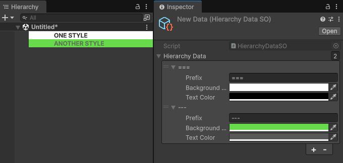

# Hierarchy Tool

Add colors and highlights to your Unity hierarchy for better scene organization.



---

## Features

- Color-code GameObjects in Hierarchy
- Automatically add them to EditorOnly tag
- Lightweight and editor-only

## Instalation

### Git URL
Open Unity -> **Window -> Package Manager** -> **Add package from Git URL...**
Paste this: https://github.com/kamuuucka/com.kamuuucka.hierarchy-tool.git

### manifest.json
Add this line to your project’s `Packages/manifest.json`:
```json
"com.kamuuucka.hierarchy-tool": "https://github.com/kamuuucka/com.kamuuucka.hierarchy-tool.git"
```

## Usage

Right click in the Assets folder.
Create -> Scriptable Objects -> HierarchyData.
Set up your colors and prefixes in the setup file.